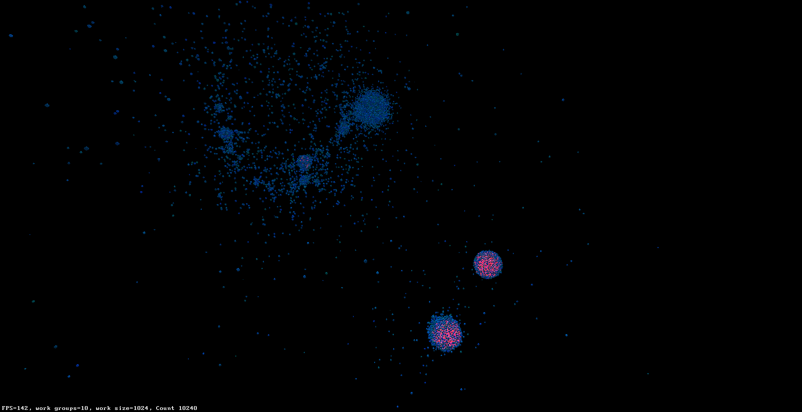

Final Project

Kelley Kelley
CSCI 4239/5239 Spring 2022

Final Project for Advanced Computer Graphics

A lot of spheres that collide with each other and do gravity.
It took way too long, but it looks really freaking cool
move around, watch some stars collide, hit m a few times to see some
other cool stars collide

Key bindings:
esc - quit
0 - reset view
r - reset particles
arrows - change view angle
pgup/pgdn - zoom in and out
m - change mode
space - pause/play simulation
wasdeq - move camera around

the easiest way to change particle amount (for performance reasons mainly)
is to change the variable maxng. However, this will cause the program to behave
differently because more particles = more total energy in the system and less particles
= less total energy in the system so if there are more particles your stars explode a lot
and if there are less they are pretty stable

Time spent: 45 hr
2 hrs doing the last project, then getting bored and deleting it all
4 hrs transferring ex22 and ex19 into this and messing with different ways to split up the work (was trying to do x y z all on different threads but slowed it down more)
2 hrs relearning physics and totally not understanding how to do 3d collisions
https://courses.lumenlearning.com/boundless-physics/chapter/collisions/
4 hrs faking physics until it looked like what I wanted
Basically the physics in the compute shader are mostly copied from ex22 but
I did a lot of tweaking for the collisions
4 hours instancing icosahedrons
Ok, so then I went to do collisions correctly
I literally went through all of these things trying
them all in various ways figuring out what they meant:
https://github.com/3b1b/manim
https://github.com/mattleibow/jitterphysics/tree/master/source/Jitter/Collision
https://docs.unity3d.com/ScriptReference/Collider.OnCollisionEnter.html
https://stackoverflow.com/questions/56088821/how-to-code-a-collision-and-reaction-between-two-objects-in-javascript
https://code.tutsplus.com/series/collision-detection-and-reaction--active-10878
http://www.metanetsoftware.com/technique/diagrams/tutA_demo.html
https://citeseer.ist.psu.edu/forgotaccount
https://stackoverflow.com/questions/3251561/good-2d-collision-response-references
https://developer.mozilla.org/en-US/docs/Games/Techniques/2D_collision_detection
https://www.omnicalculator.com/math/angle-between-two-vectors#angle-between-two-vectors-formulas
https://www.cuemath.com/questions/in-the-diagram-of-circle-a-what-is-the-measure-of-xyz/
https://math.stackexchange.com/questions/490218/3d-rotation-decomposition
https://byjus.com/jee-questions/what-is-a-3d-angle/
https://www.youtube.com/watch?v=eED4bSkYCB8
https://www.youtube.com/watch?v=wVhSQHKvBW4
https://www.youtube.com/watch?v=qe1OQ92NoqU
https://relativity.net.au/gaming/java/CollidingSpheres.html
https://stackoverflow.com/questions/3232318/sphere-sphere-collision-detection-reaction
https://physics.stackexchange.com/questions/107648/what-are-the-general-solutions-to-a-hard-sphere-collision
https://www.gamedeveloper.com/programming/pool-hall-lessons-fast-accurate-collision-detection-between-circles-or-spheres
https://studiofreya.com/3d-math-and-physics/simple-sphere-sphere-collision-detection-and-collision-response/
https://mozdevs.github.io/gamedev-js-3d-aabb/physics.html
Then this video helped me actually understand what's happening
https://www.youtube.com/watch?v=eED4bSkYCB8&t=826s
But then, I found this one, which actually explains it well, and it took me 3 minutes.
I don't want to talk about it.
https://www.vobarian.com/collisions/2dcollisions2.pdf
14 hours trying to do collisions
2 hour gravity (I was trying different ways but gave up and decided this was best)
3 hours just watching it creating modes and messing around because once it worked,
it is a beautiful masterpeice that is very fun to watch
8 hours messing around, making new modes, seeing what happens, I just have a really cool simulation now so I'm playing with it a lot and tweaking things
